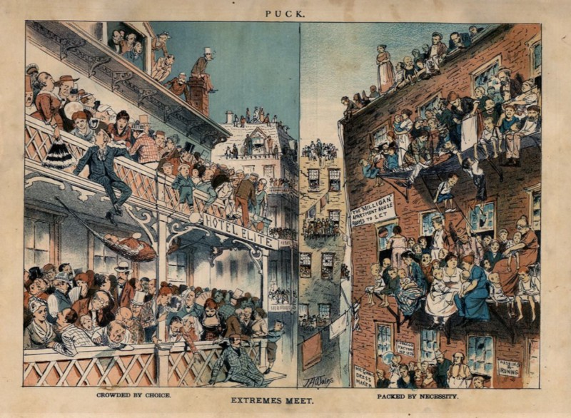

Whenever I’m listening to someone complain about their life (thankfully not often) I’m always tempted to throw out one of my favorite idioms: “it could always be worse.” I love to illustrate the power of this expression by recounting a Yiddish fable[^1] about a farmer and his crowded house. The poor desperate farmer goes to his rabbi complaining about how his one-room hut is too crowded given his six children and that the noise is driving him crazy. To the farmer’s surprise, the rabbi recommends he bring a few animals into his house, which unsurprisingly, does not improve the farmer’s mood. He returns to the rabbi who recommends taking in even more animals. This cycle of animal buildup continues until the rabbi recommends taking all of the animals out of his house. Finally, in a physical state no different from the one he started in, the farmer remarks that his house is “‘so quiet, so roomy, so peaceful’.”

While a cute and sympathetic fable, people tend not to be especially receptive to its message: “it could always be worse.” When I, sparingly, express this thought I’ve gotten replies, both directly and indirectly, that “sure, it could _always_ be worse but I don’t care about this general mantra right now; what I really want is some combination of specific advice for my current situation and generally sympathy.” Additionally, they may think that I’m diminishing their negative situation by painting it as minuscule compared to the plight of others. Granted, sometimes specific advice and sympathy can be helpful. However, often I find this stream of life complaints to be a more general negative characterization of one’s life, of the quality of life compared to others or what could have been. Given these thoughts, the perspective of “it could always be worse” is _essential._ Instead of asserting that their specific problem is minuscule, I’m trying to provide them with a suggestion to step back and consider their broad characterizations about their life.

Sit down and close your eyes. Imagine (or for some, remember) the pangs of hunger as you struggle to afford food. Imagine the excruciating pain of an illness for which you cannot access medical care. Imagine the gripping fear of a firefight outside your home. Just imagine. Sink into the visual and emotional perspective of someone else. It’s painful, but it’s also enlightening, like a good cry. Realize the world is _shit_. Sure, as a whole it’s getting better and one day we may be able to largely solve the world’s problems. In that time, we’ll simply look back at history with the same techniques to realize the world _was shit._ In some future utopia/dystopia were there are no problems except that all of history is erased, we can imagine a possible world that _could be shit_.

I guess I love this phrase, “it could always be worse,” because I find the imaginative exercise I described to be so cathartic[^2]. In a way, that seems kind of twisted. Am I not boosting my mood by imagining the misery of others? While a clinical measure of my mood might show an improvement, that’s not the point. The point is an act of normalization (in the mathematical not sociological sense). This exercise helps reframe the magnitude of my concerns and complaints and simultaneously develop sympathy for those in need.

So next time you’re upset about your life or some particular aspect of it, stop for a moment and take a step back. Compare your situation to a diverse set of others, real and imagined. If you live in a generally privileged environment, imagine not having that privilege. You don’t even have to imagine real people, trust me, the dark depths of your mind can construct some vicious possibilities; although, there is plenty of misery in the world to draw on. Enjoy your life as it currently exists. After all, it could always be worse.

[^1]: The story supposedly [originates in Poland](https://www.uua.org/re/tapestry/children/home/session4/60031.shtml). Here are two retellings by [Margot Zemach](https://jewishcamp.org/wp-content/uploads/2018/05/Appendix-Working-With-Young-Campers-it_could_always_be_worsre.pdf) and [Aaron Zerah](https://www.beliefnet.com/love-family/parenting/2000/10/teaching-tales-the-way-you-like-it.aspx). If you’d like an illustrated version there is [_It Could Always Be Worse: A Yiddish Folk Tale_ by Margot Zemach](https://www.goodreads.com/book/show/669386.It_Could_Always_Be_Worse), which again because of ridiculous copyright laws, will only become freely distributable in the U.S. in 2064. Annoyingly, the story seems to have no canonical name; I propose “The Farmer and the Crowded House” mimicking Aesop-like titles.
[^2]: Many people might call this catharsis a realization of _privilege._ I’ve avoided using this term so far to avoid shutting out people who’ve (unnecessarily) been prescribed extremely negative views about that term. Some may unsympathetically view this as pandering to an audience which deserves no attention; however, I think it’s fine to try and change someone’s opinion about a subject while skirting around a charged, however legitimate, term. We can never hope to change closed minds or shift entrenched opinions without making some attempt to ease people into new ideas. Many may have superficially negative views of the term _privilege_ just because of their environment without a deeper view of what the term might entail. Also, when people use the term _privilege_ they usually have an external focus, as in “realize others may not have the privilege you have”; my focus is more internal, as in using realization of your privilege to normalize the criticism of your own life.
